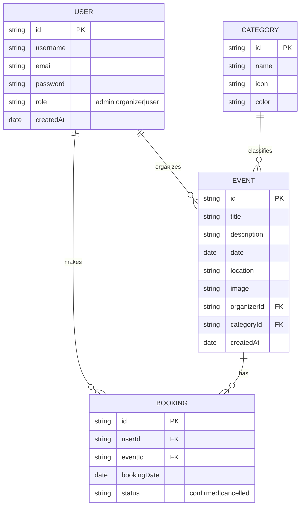

# Event Management System - ER Diagram

```mermaid
erDiagram
    USER ||--o{ EVENT : "organizes"
    USER ||--o{ BOOKING : "makes"
    EVENT ||--o{ BOOKING : "has"
    CATEGORY ||--o{ EVENT : "classifies"

    USER {
        string id PK
        string username
        string email
        string password
        string role "admin|organizer|user"
        date createdAt
    }

    EVENT {
        string id PK
        string title
        string description
        date date
        string location
        string image
        string organizerId FK
        string categoryId FK
        date createdAt
    }

    CATEGORY {
        string id PK
        string name
        string icon
        string color
    }

    BOOKING {
        string id PK
        string userId FK
        string eventId FK
        date bookingDate
        string status "confirmed|cancelled"
    }

```
